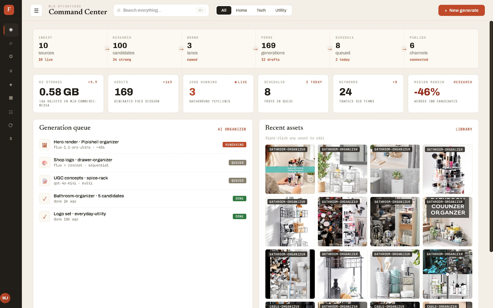
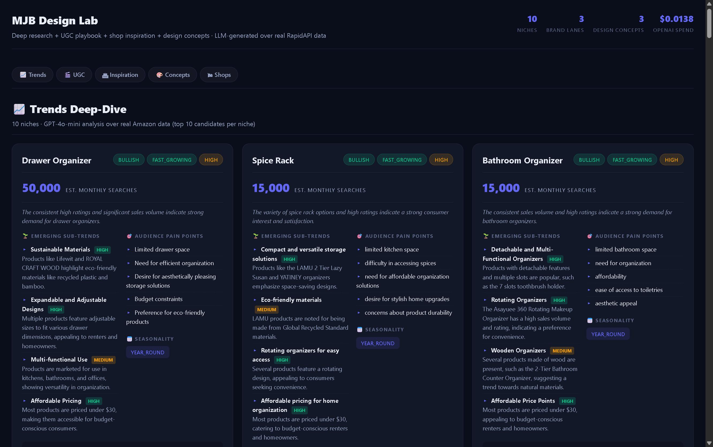
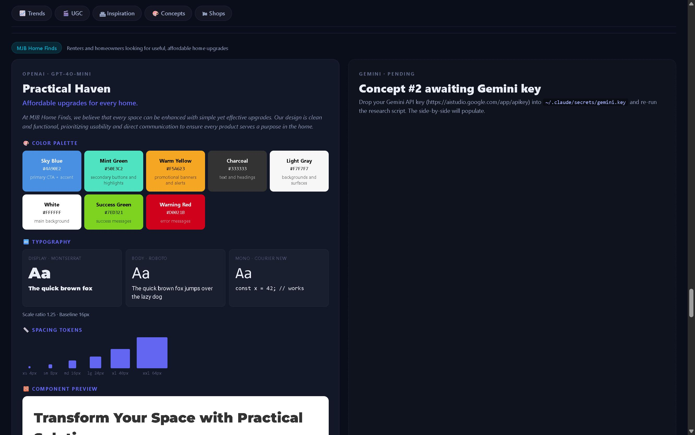
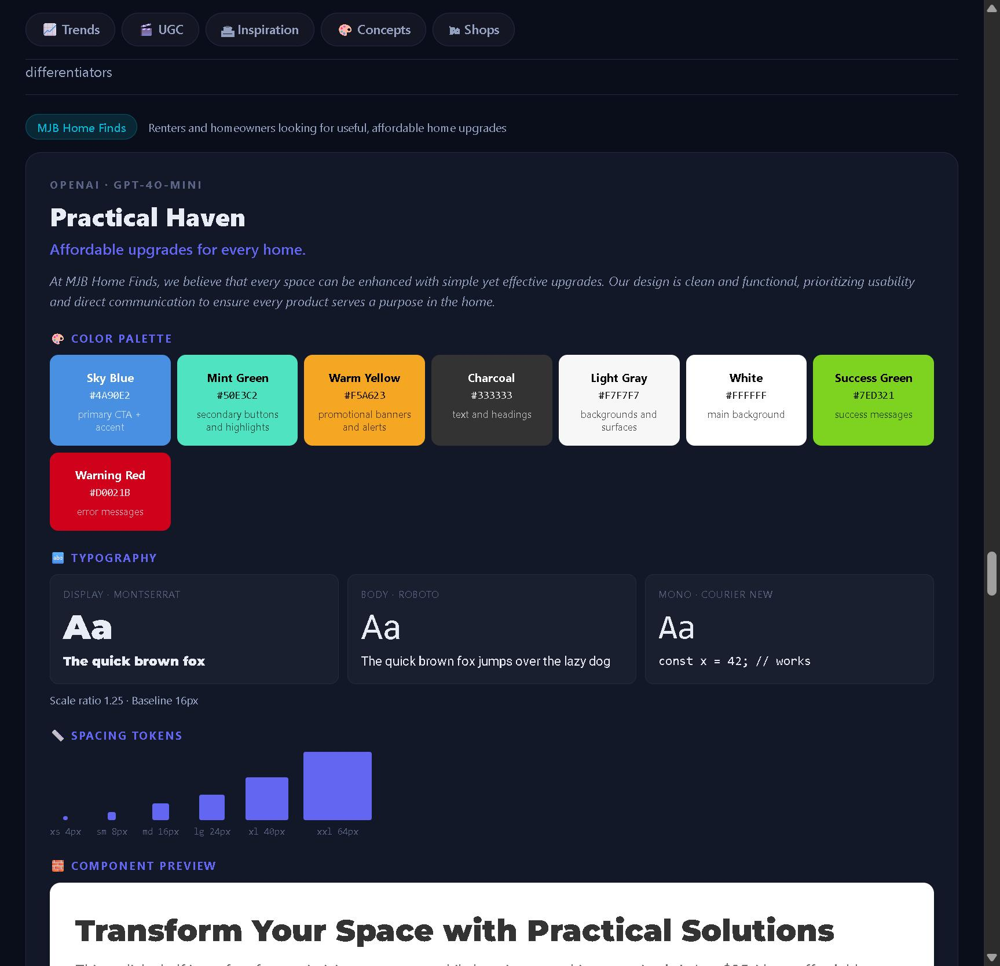

# Code Module Library

> A portable, full-stack **capability library** for dashboards and automation
> systems — a catalog of vertically-integrated capabilities, each shipping its
> own UI, backend, optional cloud relay, typed contracts, diagnostics, and
> install surface, so you build a thing **once** and drop it into any dashboard.


This is not a box of React components. It is a catalog organized around
**capabilities** — reusable operational primitives (connect, ingest, normalize,
index, operate, observe, recover). Technologies like Gmail, Leaflet, Cloudflare,
or node-pty are **adapters** plugged into a capability, never the organizing
principle.

The repo is a TypeScript monorepo (npm workspaces + project references) that
typechecks end to end (`tsc -b`), validates its own catalog from a
machine-readable registry, and runs under Vitest. Every capability — even the
ones that are still scaffolds — ships a **zod-validated `manifest.yaml`** and a
**typed `contracts/` surface**, so the protocol is importable before a single
line of runtime exists.

---

## Why this shape

Most dashboards accrete features as one-off React screens wired directly to one
vendor SDK. Swapping the vendor, reusing the feature elsewhere, or reasoning
about its failure modes means re-reading the whole screen. This library inverts
that: a **capability** is a self-contained, vertically-integrated system with a
declared contract, so it can be lifted into any host dashboard and its blast
radius is knowable up front.

Every capability satisfies one standard:

```
Capability = UI + Protocol + Runtime + Persistence + Auth + Diagnostics + Setup + Sharp Edges
```

and declares — in `manifest.yaml`, validated by `@multimarcdown/core` — its
surfaces, required env/secrets, ports, provided routes/events, risk level, and
health checks. The root `registry.yaml` is the curated catalog of truth; core
loads and validates all of it.

## The four layers

| Layer | What it is | Lives in |
|-------|-----------|----------|
| **ui** | Reusable visual components (badges, chips, panes) — no backend | `packages/ui` |
| **feature** | UI + local logic (hooks, clients, config) | inside a capability |
| **capability** | Full-stack reusable system (UI + backend + cloud + contracts + diagnostics) | `packages/capabilities/*` |
| **workflow** | Orchestration recipe composed from capabilities | `packages/workflows/*` |

## Maturity — an honest map

The library is deliberately catalog-first: the **architecture and contracts are
the deliverable**, and capabilities are filled in behind a stable protocol. The
`status` field in `registry.yaml` is authoritative. As of this snapshot, of the
**48 registered capabilities**:

| Status | Count | What "done" means here |
|--------|-------|------------------------|
| **production-ready** | 2 | Real backend + frontend/scripts, docs, and a worked reference implementation |
| **prototype** | 5 | Substantial implementation behind the contract; partial or evolving surface |
| **planned** | 41 | Validated `manifest.yaml` + typed `contracts/` (protocol importable); no runtime yet |

Plus `packages/core`, `packages/ui`, **11 adapters**, and **25 workflow** recipes.

> The `planned` capabilities are intentionally not deleted — they are the
> argument. Each one is a design already reduced to a validated manifest and a
> typed event/schema contract, so building it is "fill in the runtime," not
> "invent the shape." Don't assume a `planned` capability has a runnable service.

### Built out today

| Capability | Status | Risk | What's actually there |
|-----------|--------|------|-----------------------|
| **local-agent-terminal** | production-ready | privileged | node-pty backend, bridge daemon, Cloudflare Durable Object relay, xterm React frontend, launch profiles, full docs |
| **bulk-media-import** | production-ready | filesystem-write | S3-compatible → R2 + D1 import pipeline; measured 41 files/sec |
| **replicate-api** | prototype | external-ai-processing | Typed, zod-validated client wrapping ~35 Replicate endpoints across 10 services |
| **deepseek-router** | prototype | external-ai-processing | CLI that points Claude Code / any Anthropic-SDK consumer at DeepSeek's Anthropic-compatible endpoint, with tier pinning + cost re-computation |
| **e-signature** | prototype | sensitive-data | ESIGN/UETA two-party signing portal, componentized from a 1,771-line monolith; SHA-256 hashing + audit trail |
| **booking-scheduler** | prototype | sensitive-data | 5-step booking flow with D1 persistence, ICS attachment, short-slug join links |
| **web-clipper** | prototype | sensitive-data | Web page → canonical markdown with layered fallback extraction |

The remaining 41 capabilities (connector-config, email-connector,
intake-pipeline, document-ingestion, knowledge-index, geo-visualization,
scheduler, notify, cost-ledger, and a full commerce-pipeline family, among
others) are `planned` — browse `registry.yaml` for the complete catalog with
per-entry summaries and risk levels.

## Three worth reading

### `local-agent-terminal` — the reference capability

A persistent browser terminal that survives page reloads and network drops.

- **Backend** (`backend/`): a `node-pty` service, a long-lived **bridge daemon**,
  and HTTP routes. PTYs outlive the browser; the daemon reconnects and re-claims.
- **Cloud relay** (`cloudflare/pty-router.ts`): a Cloudflare **Durable Object**
  that bridges a local daemon to an HTTPS front-end when the browser can't reach
  localhost. Eviction is **incumbent-wins** (newest-wins makes two backends flap
  forever); bridge rejection sends WS close `4001` and the loser backs off ≥ 60s.
- **Frontend** (`frontend/PtyTerminal.tsx`): xterm.js with a launch-profile
  picker (Claude Code, shells, dev servers) and a small terminal store.
- **Sharp edges are documented, not discovered in prod** — see
  `docs/sharp-edges.md`: `CLAUDECODE=1` must be stripped from the child env or a
  nested agent refuses to launch; a singleton `idFromName('default')` means one
  bridge per relay; the idle reaper kills PTYs with zero listeners after 30 min.

This is the capability the whole standard was reverse-engineered from — it
already carries every slice (protocol, runtime, persistence, cloud/local
bridging, setup, diagnostics), and every other capability copies its shape.

### `bulk-media-import` — a throughput story

An end-to-end pipeline that moves media from an S3-compatible source into
Cloudflare **R2 + D1**. The interesting part is the measured decision to bypass
`wrangler r2 object put` in favor of the **AWS SDK's direct PUT** — a **~28×
speedup** that sustained **41 files/sec (2,549 files / 362 MB in under two
minutes)**. Five stages: browser-scrape → download bundle → parallel curl + b64
extract → 32-parallel R2 puts → chunked D1 `INSERT`. Cross-platform
(Windows/Linux/macOS). See `scripts/fast_upload.mjs` and `docs/architecture.md`.

### `replicate-api` — a typed client done properly

A single `createReplicate()` facade over the entire Replicate REST API: ten
resource services (predictions, models, versions, deployments, trainings,
collections, hardware, account, webhooks, beta search) each **zod-validated**,
with bearer auth, `429` retry-after handling, cursor pagination, synchronous
mode via `Prefer: wait`, and `Cancel-After` deadlines. The contract lives in
`contracts/schemas.ts`; the services in `backend/*.service.ts`.

## Using core

```ts
import { bus, jobs, health, secrets, createLogger, loadRegistry } from '@multimarcdown/core';

bus.onPrefix('document.', (e) => console.log('ingestion event', e.event));
jobs.register('email-connector:syncAccount', async (ctx) => { /* … */ });
health.register('my-capability', 'reachable', async () => ({ state: 'healthy' }));
```

Capabilities register handlers with these shared primitives — they do **not**
invent their own event/job/health mechanism. Print and validate the catalog:

```bash
npm run registry:print
```

## Build & test

```bash
npm install          # npm workspaces; local-agent-terminal's node-pty needs native build tools
npm run typecheck    # tsc -b across all project references
npm test             # vitest
npm run lint         # eslint 9 flat config
npm run registry:print   # load + zod-validate registry.yaml, then dump it
```

> For a non-terminal subset you can build `@multimarcdown/core` and
> `@multimarcdown/ui` alone — only `local-agent-terminal` pulls the native
> `node-pty` and xterm peer deps.

## Layout

```
code-module-library/
  registry.yaml                the curated catalog (single source of truth)
  packages/
    core/                      manifest, registry, events, jobs, health,
                               config, secrets, diagnostics, logging
    ui/                        reusable visual components (StatusBadge, …)
    capabilities/*             48 capabilities (see registry.yaml for status)
      local-agent-terminal/    ★ the fully-built reference capability
      bulk-media-import/       ★ S3 → R2 + D1 throughput pipeline
      replicate-api/           typed Replicate client
      …
    adapters/*                 provider implementations (gmail, leaflet, ollama, …)
    workflows/*                composed recipes (pdf-to-rag, folder-watch-rename, …)
  templates/
    capability-template/       copy this to start a new capability
  knowledge/                   human-authored specs, guides, and decision records
  tools/                       repo-local CLIs (scan, manifest-validate, scaffold, …)
  generated/                   machine-emitted inventory (git-ignored; see its README)
  mockups/                     UI design mockups + screenshots (see below)
```

## Adding a capability

1. `cp -r templates/capability-template packages/capabilities/<name>`
2. Fill in `manifest.yaml`; add an entry to `registry.yaml`.
3. Define `contracts/` (events + zod schemas) **first**, then the service, then UI.
4. Register health checks + job handlers with `@multimarcdown/core`.
5. Write `docs/architecture.md`, `docs/diagnostics.runbook.md`, `docs/sharp-edges.md`.

Contracts-first is the whole point: the protocol is stable before any
implementation depends on it.

## Screenshots

Design mockups for the dashboard surfaces these capabilities target. The
**Design Lab** page is fully self-contained and can be hosted directly on
GitHub Pages as a live visual demo: [`mockups/design-lab.html`](mockups/design-lab.html).

| | |
|---|---|
|  |  |
| Operations "Command Center" — pipeline status, R2 storage, live generation queue, asset library | Design Lab — trends deep-dive with per-niche analysis, pain points, and seasonality |
|  |  |
| Design-concept boards | Side-by-side concept comparison |

## The principle

> **Connect → Ingest → Normalize → Index → Operate → Assist → Observe → Recover.**

Those are the reusable operational primitives. If a proposed module doesn't fit
one of them, the abstraction is wrong — that's the conversation to have before
writing code. Start with `packages/capabilities/local-agent-terminal/` and its
`docs/sharp-edges.md`, then `knowledge/specs/sharp-edges-cross-capability.md` for
the landmines that span the whole library.

## License

MIT — see [LICENSE](LICENSE).
