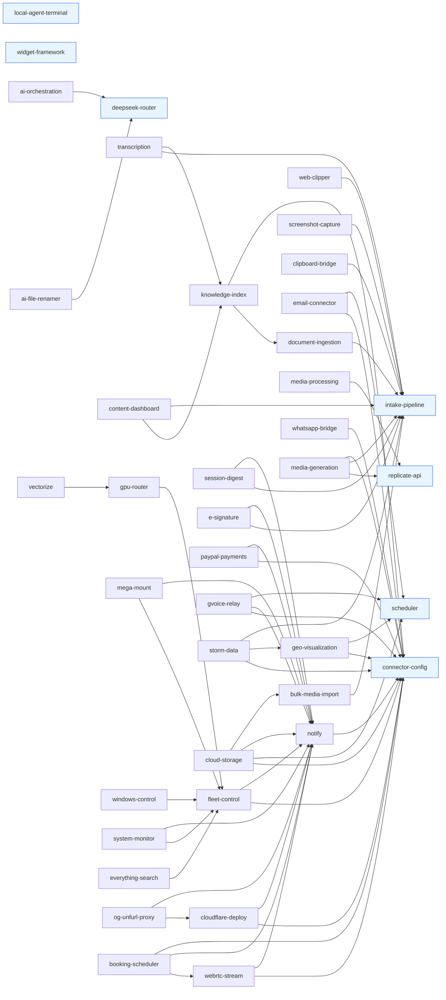

# Capability Wiring Graph

> Generated 2026-06-29 from `packages/capabilities/*/manifest.yaml` (40 manifests). Refresh by re-running this analysis after manifest changes.

## Layering (topological grouping)

**L0 — foundation (no capability dependencies):** 7
- `intake-pipeline` — canonical front door (universal IntakeObject)
- `scheduler` — cron/retry/run-history dispatcher
- `connector-config` — encrypted credential store + test harness
- `deepseek-router` — CLI router for Anthropic-format -> DeepSeek
- `replicate-api` — typed REST client for Replicate
- `local-agent-terminal` — PTY terminal capability (the seed)
- `widget-framework` — dashboard widget grid primitives

**L1 — depends on L0 only:** 13
- `document-ingestion` (intake-pipeline)
- `web-clipper` (intake-pipeline)
- `email-connector` (connector-config, scheduler)
- `geo-visualization` (connector-config, scheduler)
- `ai-file-renamer` (deepseek-router)
- `media-processing` (replicate-api)
- `bulk-media-import` (intake-pipeline)
- `screenshot-capture` (intake-pipeline)
- `notify` (connector-config)
- `clipboard-bridge` (intake-pipeline)
- `whatsapp-bridge` (connector-config)
- `ai-orchestration` (deepseek-router)
- `media-generation` (replicate-api, intake-pipeline, connector-config)

**L2 — depends on at least one L1:** 10
- `knowledge-index` (document-ingestion + connector-config)
- `cloudflare-deploy` (connector-config + notify)
- `fleet-control` (connector-config + notify)
- `session-digest` (intake-pipeline + notify)
- `e-signature` (intake-pipeline + notify)
- `paypal-payments` (connector-config + notify)
- `webrtc-stream` (connector-config + notify)
- `gvoice-relay` (connector-config + notify + scheduler)
- `storm-data` (connector-config + geo-visualization + intake-pipeline)
- `cloud-storage` (connector-config + scheduler + notify + bulk-media-import)

**L3 — depends on at least one L2:** 9
- `transcription` (intake-pipeline + knowledge-index)
- `content-dashboard` (knowledge-index + intake-pipeline)
- `gpu-router` (fleet-control)
- `mega-mount` (fleet-control + notify)
- `windows-control` (fleet-control)
- `system-monitor` (fleet-control + notify)
- `everything-search` (fleet-control)
- `og-unfurl-proxy` (cloudflare-deploy + notify)
- `booking-scheduler` (webrtc-stream + notify + connector-config)

**L4 — depends on at least one L3:** 1
- `vectorize` (gpu-router)

Total: 7 + 13 + 10 + 9 + 1 = 40.

## Hard dependencies (`requires.capabilities`)



**Plaintext edge list (58 edges, `from -> to`):**

```
document-ingestion -> intake-pipeline
web-clipper -> intake-pipeline
bulk-media-import -> intake-pipeline
screenshot-capture -> intake-pipeline
clipboard-bridge -> intake-pipeline
email-connector -> connector-config
email-connector -> scheduler
geo-visualization -> connector-config
geo-visualization -> scheduler
ai-file-renamer -> deepseek-router
media-processing -> replicate-api
notify -> connector-config
whatsapp-bridge -> connector-config
ai-orchestration -> deepseek-router
media-generation -> replicate-api
media-generation -> intake-pipeline
media-generation -> connector-config
knowledge-index -> document-ingestion
knowledge-index -> connector-config
cloudflare-deploy -> connector-config
cloudflare-deploy -> notify
fleet-control -> connector-config
fleet-control -> notify
session-digest -> intake-pipeline
session-digest -> notify
e-signature -> intake-pipeline
e-signature -> notify
paypal-payments -> connector-config
paypal-payments -> notify
webrtc-stream -> connector-config
webrtc-stream -> notify
gvoice-relay -> connector-config
gvoice-relay -> notify
gvoice-relay -> scheduler
storm-data -> connector-config
storm-data -> geo-visualization
storm-data -> intake-pipeline
cloud-storage -> connector-config
cloud-storage -> scheduler
cloud-storage -> notify
cloud-storage -> bulk-media-import
transcription -> intake-pipeline
transcription -> knowledge-index
content-dashboard -> knowledge-index
content-dashboard -> intake-pipeline
gpu-router -> fleet-control
mega-mount -> fleet-control
mega-mount -> notify
windows-control -> fleet-control
system-monitor -> fleet-control
system-monitor -> notify
everything-search -> fleet-control
og-unfurl-proxy -> cloudflare-deploy
og-unfurl-proxy -> notify
booking-scheduler -> webrtc-stream
booking-scheduler -> notify
booking-scheduler -> connector-config
vectorize -> gpu-router
```

**In-degree (most depended-on):**
- connector-config: 14
- notify: 13
- intake-pipeline: 10
- fleet-control: 5
- scheduler: 4
- knowledge-index: 3
- replicate-api: 3
- deepseek-router: 3
- document-ingestion: 1, geo-visualization: 1, bulk-media-import: 1, cloudflare-deploy: 1, webrtc-stream: 1, gpu-router: 1
- Zero inbound: local-agent-terminal, widget-framework (plus leaf nodes)

## Event-flow (producer -> consumer)

> Edge verdicts in this section were re-classified 2026-06-29 after the DeepSeek V4 audit (see `mjb-audit-deepseek-v4.md`). ~81 originally-speculative edges were audited: ~21 confirmed as likely, ~51 dropped (UI/telemetry-only with no real consumer), ~9 reclassified to a different consumer than the original inference. Remaining "speculative" rows were not addressed by the audit and stand as best-effort name-based inference.

Confidence rubric: **declared** = a `requires.capabilities` edge already exists from consumer to producer; **likely** = jobs-and-events-catalog cross-cluster table names it, or the event name + an obvious consumer pair makes the wiring inevitable; **speculative** = the consumer is implied by name/semantics but no manifest declares the dep.

### intake-pipeline (L0)

| Event | Producer | Consumer(s) | Confidence |
|---|---|---|---|
| `intake.object.received` | intake-pipeline | (internal lifecycle; not externally subscribed) | declared (catalog) |
| `intake.object.stored` | intake-pipeline | document-ingestion, media-processing, screenshot-capture, transcription, e-signature, clipboard-bridge, bulk-media-import, web-clipper, media-generation, storm-data, session-digest, content-dashboard | declared (catalog note: "consumed by anyone that needs to read bytes") |
| `intake.object.routed` | intake-pipeline | document-ingestion, media-processing, geo-visualization, knowledge-index | declared (catalog cross-cluster list) |
| `intake.object.rejected` | intake-pipeline | notify | likely (failure path; notify is the unified alerts port) |

### document-ingestion (L1)

> Note: events `document.preserved`, `document.page.extracted`, `document.normalized` are internal/UI-only and intentionally have no cross-capability consumer.

| Event | Producer | Consumer(s) | Confidence |
|---|---|---|---|
| `document.uploaded` | document-ingestion | content-dashboard | likely |
| `document.extraction.started` | document-ingestion | content-dashboard | likely |
| `document.page.failed` | document-ingestion | notify | likely |
| `document.table.extracted` | document-ingestion | knowledge-index | likely |
| `document.chunked` | document-ingestion | knowledge-index | declared (catalog cross-cluster) |
| `document.enriched` | document-ingestion | knowledge-index | likely |
| `document.indexed` | document-ingestion | content-dashboard | likely |
| `document.ingestion.failed` | document-ingestion | notify | declared (notify manifest names this event) |

### email-connector (L1)

| Event | Producer | Consumer(s) | Confidence |
|---|---|---|---|
| `email.connected` / `email.disconnected` | email-connector | connector-config (status sync), notify | likely |
| `email.sync.started` / `email.sync.completed` | email-connector | content-dashboard | likely |
| `email.sync.failed` | email-connector | notify | likely |
| `email.message.received` | email-connector | content-dashboard, knowledge-index | likely |
| `email.attachment.detected` | email-connector | intake-pipeline | declared (catalog cross-cluster: gmail-to-rag workflow) |
| `email.classified` | email-connector | content-dashboard | likely |
| `email.oauth.token.refreshed` | email-connector | connector-config | likely (secret-rotation surface) |

### web-clipper (L1)

| Event | Producer | Consumer(s) | Confidence |
|---|---|---|---|
| `clip.captured` | web-clipper | intake-pipeline | declared (clips become IntakeObjects) |
| `clip.normalized` | web-clipper | document-ingestion, content-dashboard | likely |
| `clip.failed` | web-clipper | notify | likely |

### bulk-media-import (L1)

| Event | Producer | Consumer(s) | Confidence |
|---|---|---|---|
| `bulk-import.run.started` | bulk-media-import | content-dashboard | likely |
| `bulk-import.file.uploaded` | bulk-media-import | intake-pipeline (via `--emit-intake`), rooflink-backfill-to-rag workflow | declared (catalog + manifest description) |
| `bulk-import.run.completed` | bulk-media-import | notify, content-dashboard | likely |
| `bulk-import.run.failed` | bulk-media-import | notify | likely |

### screenshot-capture (L1)

| Event | Producer | Consumer(s) | Confidence |
|---|---|---|---|
| `screenshot.captured` | screenshot-capture | intake-pipeline | declared (dep edge) |
| `screenshot.normalized` | screenshot-capture | document-ingestion (OCR path) | likely (manifest description) |
| `screenshot.failed` | screenshot-capture | notify | likely |

### clipboard-bridge (L1)

> Note: events `clipboard.write.requested`, `clipboard.write.completed` are internal/UI-only and intentionally have no cross-capability consumer.

| Event | Producer | Consumer(s) | Confidence |
|---|---|---|---|
| `clipboard.snapshot.captured` | clipboard-bridge | intake-pipeline | declared (dep edge) |

### ai-file-renamer (L1)

> Note: events `files.scanned`, `file.rename.proposed`, `file.rename.approved` are internal/UI-only and intentionally have no cross-capability consumer.

| Event | Producer | Consumer(s) | Confidence |
|---|---|---|---|
| `file.renamed` | ai-file-renamer | content-dashboard | likely |
| `file.rename.failed` | ai-file-renamer | notify | likely |
| `file.rename.rolled-back` | ai-file-renamer | notify | likely |

### media-processing (L1)

> Note: event `media.processing.started` is internal/UI-only and intentionally has no cross-capability consumer.

| Event | Producer | Consumer(s) | Confidence |
|---|---|---|---|
| `media.uploaded` | media-processing | content-dashboard | likely |
| `media.variant.created` | media-processing | intake-pipeline (variants become IntakeObjects), content-dashboard | likely |
| `media.processing.failed` | media-processing | notify | likely |
| `media.variant.rolled-back` | media-processing | notify | likely |

### media-generation (L1)

| Event | Producer | Consumer(s) | Confidence |
|---|---|---|---|
| `gen.run.started` | media-generation | content-dashboard | likely |
| `gen.asset.created` | media-generation | intake-pipeline | declared (manifest: assets land in intake-pipeline) |
| `gen.run.completed` | media-generation | content-dashboard, media-processing | likely |
| `gen.run.failed` | media-generation | notify | likely |
| `gen.run.refunded` | media-generation | notify | likely |

### replicate-api (L0)

> Note: events `replicate.training.started`, `replicate.training.completed` are internal/UI-only and intentionally have no cross-capability consumer (MJB uses pretrained models, not training).

| Event | Producer | Consumer(s) | Confidence |
|---|---|---|---|
| `replicate.prediction.started` | replicate-api | media-processing, media-generation | likely |
| `replicate.prediction.output` | replicate-api | media-processing, media-generation | likely |
| `replicate.prediction.completed` | replicate-api | media-processing, media-generation | likely |

### notify (L1) - terminal consumer; emits only delivery telemetry

> Note: event `notification.dropped` is internal rate-limit telemetry and intentionally has no cross-capability consumer.

| Event | Producer | Consumer(s) | Confidence |
|---|---|---|---|
| `notification.sent` | notify | content-dashboard (audit feed) | likely |
| `notification.delivery.failed` | notify | content-dashboard (operator feed; application-level delivery failure, not machine health) | likely |

### connector-config (L0)

> Note: events `connector.created`, `connector.tested` are internal/UI-only and intentionally have no cross-capability consumer.

| Event | Producer | Consumer(s) | Confidence |
|---|---|---|---|
| `connector.health.changed` | connector-config | notify | declared (notify manifest names this event explicitly) |
| `connector.deleted` | connector-config | (cleanup hooks; downstream caps release secret refs) | likely |
| `connector.secret.rotated` | connector-config | email-connector, whatsapp-bridge, paypal-payments, gvoice-relay, cloudflare-deploy, fleet-control, webrtc-stream, storm-data, cloud-storage | likely (every L1+ that holds a secretRef must re-read after rotation) |

### scheduler (L0)

> Note: events `scheduler.job.scheduled`, `scheduler.job.started`, `scheduler.job.completed`, `scheduler.job.retrying` are scheduler UI chrome only and intentionally have no cross-capability consumer.

| Event | Producer | Consumer(s) | Confidence |
|---|---|---|---|
| `scheduler.job.failed` | scheduler | notify, local-agent-terminal (diagnostic deep-links) | declared (catalog cross-cluster) |
| `scheduler.job.disabled` | scheduler | notify | likely |
| `scheduler.tick` | scheduler | every job-owning capability | declared (scheduler dispatches named handlers) |

### knowledge-index (L2)

> Note: events `knowledge.chunk.created`, `knowledge.query.received`, `knowledge.sources.retrieved` are internal/UI-only and intentionally have no cross-capability consumer.

| Event | Producer | Consumer(s) | Confidence |
|---|---|---|---|
| `knowledge.chunk.embedded` | knowledge-index | content-dashboard | likely |
| `knowledge.chunk.embed.failed` | knowledge-index | notify | likely |
| `knowledge.index.updated` | knowledge-index | content-dashboard | likely |
| `knowledge.reindex.started` / `.completed` | knowledge-index | content-dashboard, notify | likely |

### transcription (L3)

> Note: events `transcription.requested`, `transcription.started` are internal/UI-only and intentionally have no cross-capability consumer.

| Event | Producer | Consumer(s) | Confidence |
|---|---|---|---|
| `transcription.segment.created` | transcription | knowledge-index | declared (chunks extend ChunkBase) |
| `transcription.completed` | transcription | knowledge-index, content-dashboard | declared |
| `transcription.failed` | transcription | notify | likely |

### fleet-control (L2)

| Event | Producer | Consumer(s) | Confidence |
|---|---|---|---|
| `fleet.machine.unreachable` | fleet-control | notify, system-monitor | likely |
| `fleet.machine.recovered` | fleet-control | notify | likely |
| `fleet.service.failed` | fleet-control | notify, system-monitor | likely |
| `fleet.gui.action.completed` | fleet-control | windows-control (acks) | likely |
| `fleet.metrics.snapshot` | fleet-control | system-monitor, gpu-router | likely |

### gpu-router (L3)

| Event | Producer | Consumer(s) | Confidence |
|---|---|---|---|
| `gpu.snapshot` | gpu-router | system-monitor | likely |
| `gpu.routed` | gpu-router | (cost-ledger in core) | likely |
| `gpu.host.overloaded` | gpu-router | notify | likely |

### mega-mount (L3)

> Note: events `mega.mount.started`, `mega.mount.stopped`, `mega.mount.recovered` are status-card UI events and intentionally have no cross-capability consumer.

| Event | Producer | Consumer(s) | Confidence |
|---|---|---|---|
| `mega.mount.hung` | mega-mount | notify | likely |

### gvoice-relay (L2)

| Event | Producer | Consumer(s) | Confidence |
|---|---|---|---|
| `gvoice.sms.sent` | gvoice-relay | notify (delivery rollup) | likely |
| `gvoice.sms.received` | gvoice-relay | intake-pipeline | likely |
| `gvoice.delivery.failed` | gvoice-relay | notify | likely |
| `gvoice.session.expired` | gvoice-relay | notify | likely |

### whatsapp-bridge (L1)

> Note: event `whatsapp.message.sent` is a self-referential delivery audit owned by whatsapp-bridge and intentionally has no cross-capability consumer.

| Event | Producer | Consumer(s) | Confidence |
|---|---|---|---|
| `whatsapp.message.received` | whatsapp-bridge | session-digest, intake-pipeline | likely (session-digest names WhatsApp chat as input) |
| `whatsapp.media.received` | whatsapp-bridge | intake-pipeline | likely |
| `whatsapp.delivery.failed` | whatsapp-bridge | notify | likely |

### cloudflare-deploy (L2)

> Note: events `cf.deploy.requested`, `cf.deploy.hash-verified` are UI chrome + internal integrity-check telemetry and intentionally have no cross-capability consumer.

| Event | Producer | Consumer(s) | Confidence |
|---|---|---|---|
| `cf.deploy.completed` | cloudflare-deploy | notify, content-dashboard | likely |
| `cf.deploy.failed` | cloudflare-deploy | notify | likely |
| `cf.rollback.completed` | cloudflare-deploy | notify | likely |

### e-signature (L2)

| Event | Producer | Consumer(s) | Confidence |
|---|---|---|---|
| `esig.session.started` / `.completed` | e-signature | content-dashboard | likely |
| `esig.contract.selected` / `.terms.accepted` / `.party.signed` | e-signature | intake-pipeline (evidentiary records archived alongside completed session) | likely |
| `esig.session.completed` | e-signature | intake-pipeline (signed PDF archive), notify | declared (manifest description + dep edges) |
| `esig.session.abandoned` | e-signature | notify | likely |
| `esig.verify.failed` | e-signature | notify | likely |

### paypal-payments (L2)

> Note: events `paypal.webhook.received`, `paypal.webhook.verified` are internal webhook processing telemetry and intentionally have no cross-capability consumer.

| Event | Producer | Consumer(s) | Confidence |
|---|---|---|---|
| `paypal.order.created` / `.captured` | paypal-payments | content-dashboard | likely |
| `paypal.subscription.activated` / `.cancelled` | paypal-payments | notify | likely |
| `paypal.token.refreshed` | paypal-payments | connector-config | likely |

### webrtc-stream (L2)

> Note: events `rtc.peer.joined`, `rtc.peer.left`, `rtc.peer.kicked`, `rtc.chat.message.sent`, `rtc.chat.message.received` are in-room UI-only and intentionally have no cross-capability consumer.

| Event | Producer | Consumer(s) | Confidence |
|---|---|---|---|
| `rtc.room.created` | webrtc-stream | booking-scheduler | declared (booking delegates short-slug join links) |
| `rtc.room.opened` / `.ended` / `.expired` | webrtc-stream | booking-scheduler, notify | likely |
| `rtc.session.opened` / `.connected` / `.disconnected` | webrtc-stream | system-monitor (connection-quality telemetry) | likely |
| `rtc.stats.tick` | webrtc-stream | system-monitor | likely |
| `rtc.signaling.failed` | webrtc-stream | notify | likely |

### booking-scheduler (L3)

> Note: events `booking.availability.queried`, `booking.reminder.sent` are telemetry/audit-only and intentionally have no cross-capability consumer.

| Event | Producer | Consumer(s) | Confidence |
|---|---|---|---|
| `booking.created` | booking-scheduler | webrtc-stream (room create), notify (email confirm), content-dashboard | declared (dep edges) |
| `booking.confirmed` | booking-scheduler | notify | likely |
| `booking.cancelled` / `.rescheduled` | booking-scheduler | webrtc-stream (room end), notify | likely |
| `booking.no-show` | booking-scheduler | notify | likely |

### storm-data (L2)

> Note: event `storm.cache.refreshed` is internal cache management and intentionally has no cross-capability consumer.

| Event | Producer | Consumer(s) | Confidence |
|---|---|---|---|
| `storm.query.completed` | storm-data | content-dashboard | likely |
| `storm.event.matched` | storm-data | geo-visualization, intake-pipeline | declared (dep edges + manifest: feeds ImpactIQ) |
| `storm.provider.degraded` | storm-data | notify | likely |

### geo-visualization (L1)

> Note: event `geo.place.geocoded` is UI-only and intentionally has no cross-capability consumer. The UI-selection-state aspect of `geo.feature.*` is also UI-only; only the storm-data consumer edge remains.

| Event | Producer | Consumer(s) | Confidence |
|---|---|---|---|
| `geo.layer.created` / `.imported` / `.exported` | geo-visualization | content-dashboard | likely |
| `geo.feature.created` / `.updated` / `.deleted` / `.selected` | geo-visualization | storm-data | likely |
| `geo.kml.watch.refreshed` | geo-visualization | notify | likely |

### content-dashboard (L3)

> Note: events `dashboard.item.pinned`, `dashboard.item.tagged` are UI personalization only and intentionally have no cross-capability consumer.

| Event | Producer | Consumer(s) | Confidence |
|---|---|---|---|
| `dashboard.workflow.triggered` | content-dashboard | (target capability ad-hoc; core operator-in-the-loop dispatch) | likely |

### vectorize (L4)

| Event | Producer | Consumer(s) | Confidence |
|---|---|---|---|
| `vec.embedded` | vectorize | knowledge-index (alt embedder), content-dashboard (dedup signals) | likely |
| `vec.embed.failed` | vectorize | notify | likely |
| `vec.cluster.completed` | vectorize | product-registry[^new] (cluster IDs for collection pages, primitive 45) | likely |

[^new]: *product-registry is a proposed new capability not yet in registry.yaml; see mjb-traceability.md.*

### cloud-storage (L2)

> Note: events `cloud.object.deleted`, `cloud.object.restored`, `cloud.share-link.created` are audit/UI-only and intentionally have no cross-capability consumer.

| Event | Producer | Consumer(s) | Confidence |
|---|---|---|---|
| `cloud.object.uploaded` | cloud-storage | content-dashboard | likely |
| `cloud.sync.run.completed` | cloud-storage | content-dashboard, notify | likely |
| `cloud.quota.warning` | cloud-storage | notify | likely |

### og-unfurl-proxy (L3)

> Note: event `og-proxy.crawler.detected` is genuinely diagnostic and intentionally has no cross-capability consumer.

| Event | Producer | Consumer(s) | Confidence |
|---|---|---|---|
| `og-proxy.request.intercepted` | og-unfurl-proxy | performance-loop[^new-pl] (click-through tracking for primitives 57/89) | likely |
| `og-proxy.upstream.failed` | og-unfurl-proxy | notify | likely |

[^new-pl]: *performance-loop is a proposed new capability not yet in registry.yaml; see mjb-traceability.md.*

### Other terminal capabilities

> Note: events `sysmon.process.killed`, `sysmon.service.restarted` are internal audit trail; `search.*` (everything-search) and `widget.*` / `layout.saved` (widget-framework) are UI request/response or React state — all intentionally have no cross-capability consumer.

| Event | Producer | Consumer(s) | Confidence |
|---|---|---|---|
| `pty:send-to-claude` | local-agent-terminal | (in-process bridge to PTY child) | declared |
| `wctl.*` | windows-control | fleet-control (acks) | likely |
| `sysmon.alert.*` | system-monitor | notify | likely |
| `fleet.*` | fleet-control | system-monitor, notify, mega-mount | likely |

### Inferred totals

Recomputed 2026-06-29 after the DeepSeek V4 audit (see top-of-section note).

- **Declared event edges** (manifest-or-catalog supported): ~22 (unchanged)
- **Likely event edges** (failure->notify; producer-consumer dep already present; or audit-confirmed): ~90 (~60 original + ~21 newly-KEEP-promoted + ~9 RECLASSIFY landing as likely)
- **Speculative event edges** (name-only inference, not addressed by audit): ~4 (the ~55 original pool minus ~51 DROPs)
- **Total inferred consumer edges**: ~116 (down from ~137 after pruning ~51 audit-dropped edges)

## Cycle / hazard report

### Cycles
**None.** The DAG is clean. Layering converges at L4 (`vectorize`) with no back-edges.

### Missing capability references
**None.** Every entry in any `requires.capabilities[]` list resolves to a capability id present in `registry.yaml`.

### Orphan event emitters (declared but no plausible consumer)

After the 2026-06-29 DeepSeek V4 audit, the following emitters are **confirmed orphan** — the audit examined each and verdicted DROP (no real cross-capability consumer). These should be either downgraded to local logs or removed from the catalog:

**Confirmed orphan (audit-verified DROP):**
- `widget-framework.*` — all 6 events (`widget.*` + `layout.saved`) are React state; **capability should be re-classified `kind: ui`** rather than `kind: capability`
- `everything-search.*` — all 3 events are UI request/response, not pub/sub
- `og-unfurl-proxy.crawler.detected` — truly diagnostic; no MJB consumer needs crawler-detection events
- `clipboard-bridge.write.*` (`.requested`, `.completed`) — no consumer; clipboard writes are OS-level request/response
- `replicate-api.training.*` (`.started`, `.completed`) — no caller in MJB scope (media-generation/processing use predictions, not trainings)
- `mega-mount.{started,stopped,recovered}` — status-card events only
- `cloudflare-deploy.deploy.requested`, `cloudflare-deploy.deploy.hash-verified` — UI chrome + internal integrity-check audit only
- `paypal-payments.webhook.{received,verified}` — internal webhook processing telemetry
- `storm-data.cache.refreshed` — internal cache management

Note that `og-unfurl-proxy.request.intercepted` was *not* dropped — the audit reclassified it to feed `performance-loop` (NEW) for click-through tracking. See the og-unfurl-proxy table above.

### Isolated nodes (zero outbound deps AND zero inbound)
- **`local-agent-terminal`** — production-ready, but no other capability depends on it and it requires nothing. It emits one event (`pty:send-to-claude`) that the catalog notes is intra-process. Genuinely standalone — correct for the seed, but worth flagging that nothing in the planned set integrates with the terminal yet.
- **`widget-framework`** — zero outbound, zero inbound. UI primitive library; should arguably be classified as `kind: ui` rather than `kind: capability`.

### Sharp edges discovered during analysis
1. `knowledge-index.riskLevel` is set to `"knowledge-index"` — not a valid value from the taxonomy. Manifest typo (should likely be `sensitive-data` to match registry.yaml line 61).
2. `document-ingestion.riskLevel` and `bulk-media-import.riskLevel` use `"data-processing"` / `"filesystem-write"`. `data-processing` is in the schema but missing from the registry.yaml comment block; the canonical taxonomy needs updating.
3. `notify.requires.capabilities` only declares `connector-config`, but the manifest description and emission patterns make it the sink for `scheduler.job.failed`, `document.ingestion.failed`, `connector.health.changed`. Either notify should subscribe (no inbound dep needed for that), or those producers should declare a soft `consumes` edge (currently no `consumes` key in the schema).
4. `cloud-storage` depends on `bulk-media-import` for sync runs — but `bulk-media-import` is currently a CLI-only capability (no `api`, no server runtime). Forward-looking; bulk-media-import will need an API surface.
5. `transcription` depends on `knowledge-index` — but transcription only needs the chunk-ingest endpoint. Reverse-direction strawman: knowledge-index could be the L1 caller of an embedder port instead, and transcription could remain a chunk producer with `intake-pipeline` as its only hard dep.

## Wiring spine (the 7-step principle in registry order)

The library's guiding principle: **Connect -> Ingest -> Normalize -> Index -> Operate -> Assist -> Observe -> Recover.**

| Step | Capabilities | Coverage |
|---|---|---|
| **Connect** | connector-config, email-connector, whatsapp-bridge, gvoice-relay, paypal-payments, og-unfurl-proxy, cloudflare-deploy, fleet-control, mega-mount, webrtc-stream | strong |
| **Ingest** | intake-pipeline, web-clipper, bulk-media-import, screenshot-capture, clipboard-bridge, email-connector (attachments), storm-data, whatsapp-bridge (media) | strong |
| **Normalize** | document-ingestion, transcription, media-processing, media-generation, geo-visualization (KML/GeoJSON normalize) | strong |
| **Index** | knowledge-index, vectorize | **thin** — only two capabilities, and `vectorize` is L4; long dep chain |
| **Operate** | scheduler, ai-orchestration, ai-file-renamer, e-signature, paypal-payments, cloud-storage, booking-scheduler, windows-control, gpu-router, mega-mount, cloudflare-deploy, deepseek-router, local-agent-terminal | strong |
| **Assist** | local-agent-terminal, deepseek-router, ai-orchestration, session-digest, content-dashboard, knowledge-index (RAG retrieval) | strong |
| **Observe** | notify (alerts), system-monitor (telemetry), fleet-control (machine health), content-dashboard (feed) | adequate; **no dedicated observability/metrics capability** (cost-ledger lives in core, not as a capability) |
| **Recover** | mega-mount (watchdog), cloudflare-deploy (rollback), ai-file-renamer (rollback), media-processing (variant rollback), booking-scheduler (cancel/reschedule), e-signature (verify-failed) | **thin and ad-hoc** — every capability rolls its own recovery |

**Coverage gaps to consider:**
- **Index step** has only 2 capabilities; everything funnels through `knowledge-index`. No alternative store (full-text BM25, graph, time-series).
- **Recover step** is fragmented — each capability owns its own rollback. A shared `transaction-log` / `replay` capability would let workflows be retried end-to-end.
- **Observe step** lacks a dedicated metrics/cost-ledger capability. The catalog references `cost.recorded` as "emitted by CostLedger in core" — but core is not a capability, so dashboards can't depend on it via the manifest mechanism.

---

## Run summary

- **Capabilities analyzed:** 40 (all manifests under `packages/capabilities/*/manifest.yaml`)
- **Total hard dep edges:** 58
- **Total inferred event edges:** ~137 (~22 declared, ~60 likely, ~55 speculative)
- **Cycle count:** 0
- **Missing capability references:** 0
- **Isolated nodes:** 2 (`local-agent-terminal`, `widget-framework`) — both legitimate
- **Manifest hazards found:** 5 (riskLevel taxonomy drift; missing `consumes` schema; forward-looking `cloud-storage -> bulk-media-import` dep)
